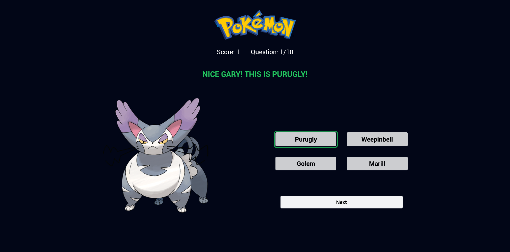
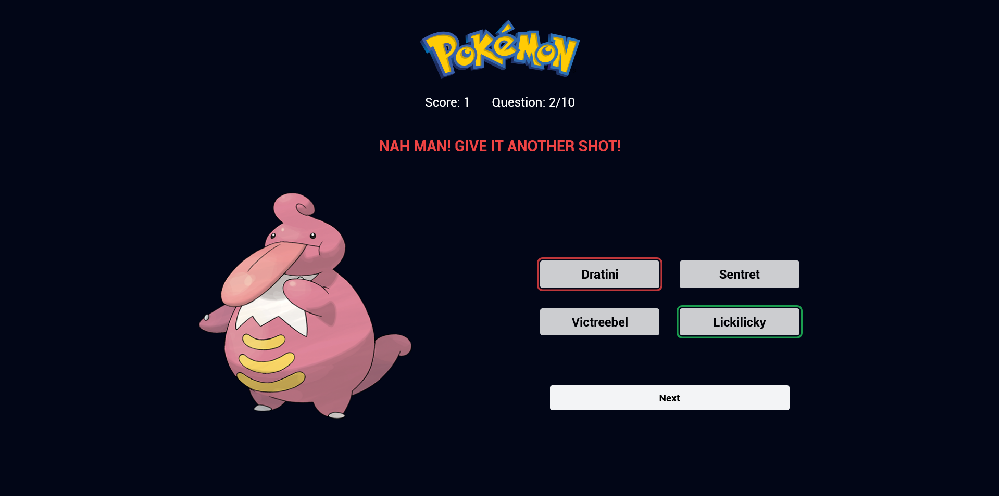
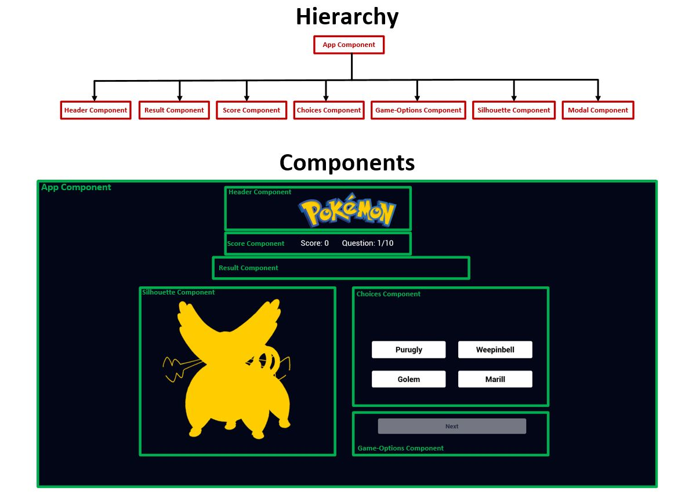

# FeWhosThatPokemon

- This is the frontend of the game whos that pokemon which is developed by Faisal ibrahim.
- This is built using Anuglar 18 and tailwindCSS.
- The application has a single page which shows the overlay of the pokemon and 4 chocies on the right.
- The next button is initially disabled.
- The player can check their score and the number of the question that they are on.
- The score and the question number are stroed in the browsers localstorage and are maintained on refresh.
- When the user slects an option from th pokemon name then the pokemon is revealed. If the right option is outlined green.
- If the user selects the wrong option then that wil be outlined red.
- There is also a success or failure message displyed below the score.
- When the user answers 10 pokemon names then the game resets and a dalog opens up to show the score of the user and indicate the completion of the game.

# How to initialize

1. clone the repo.
2. Make sure you have node installed.
3. Run command 'npm i'.
4. Run command 'npm run start' to start the server on loclahost:4200.

# Unit Tests

1. To run unit test cases in terminal, run command 'npm run test-ci'
2. To run unit test cases in browser, run command 'npm run test'.
3. To run the coverage of the unit test cases, run command 'npm run test-coverage'.

# E2E Tests

1. To run Cypress E2E test cases, run command 'npm run cypress:open'.

# ESLint

1. To run linting on the entire app run command 'npm run eslint'

# Screenshots
- Main Page
  

- Correct Answer
  

- Wrong Answer
  

- Structure
  
